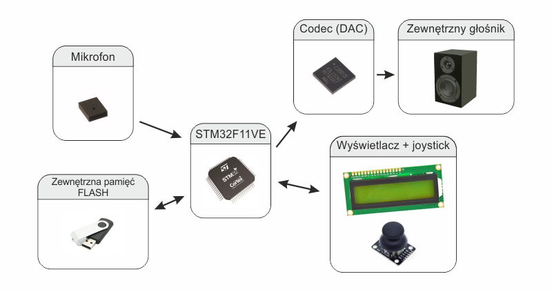

# Automatyczna Sekretarka

Wykonawcy projektu:
 * Dawid Jarząbek
 * Michał Dołharz

 Prowadzący projekt:
 * dr inż. Wojciech Domski

## Opis projektu

Celem projektu jest zbudowanie "automatycznej sekretarki", czyli urządzenia zdolnego do nagrywania dźwięków (wiadomości głosowych) i odtwarzania ich. Projekt jest realizowany na płytce STM32F411VET DISCOVERY z wykorzystaniem wbudowanego mikrofonu MEMS MP45DT02 oraz wbudowanego codeca wraz z zewnętrznym odtwarzaczem audio z końcówką mini-jack. Dodatkowo zaplanowane jest stworzenie prostego interfejsu w oparciu o wyświetlacz alfanumeryczny LCD 2x16 i joystick. 

